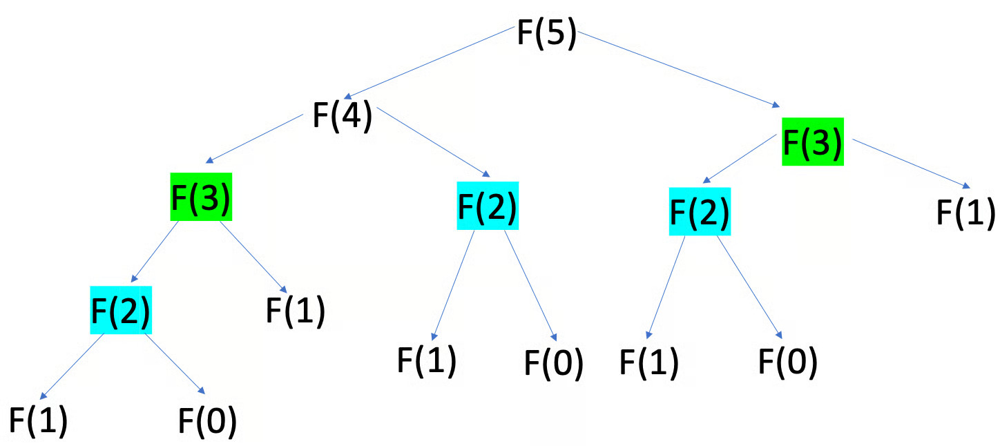
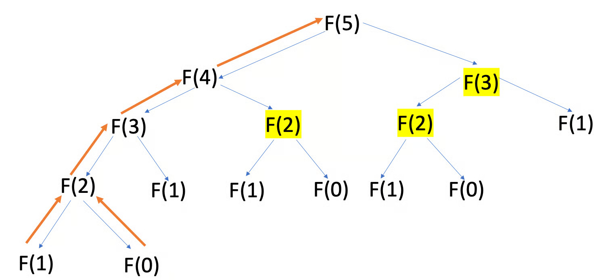
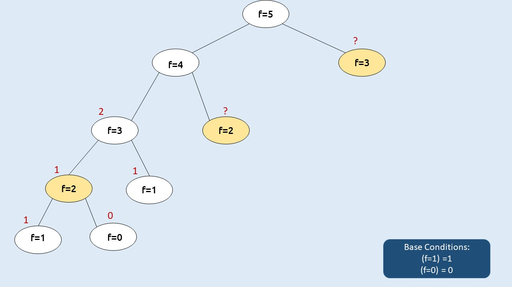
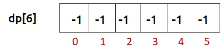
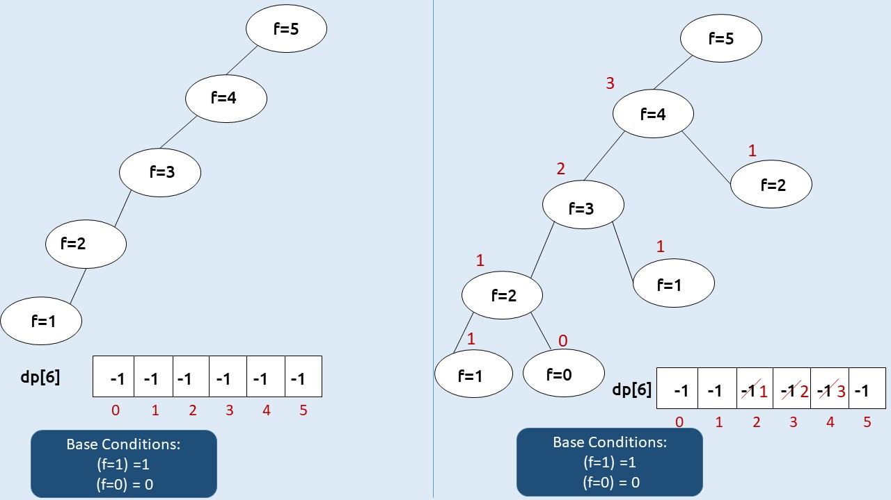
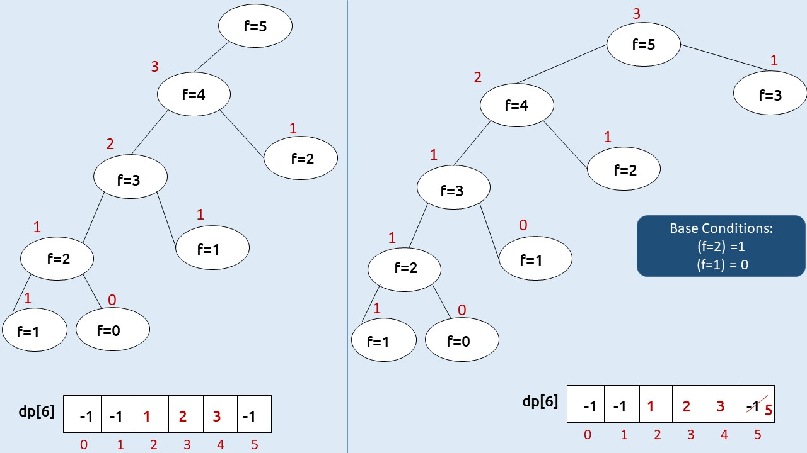

# Dynamic Programming - From Zero to Hero 🚀

> A comprehensive guide to mastering Dynamic Programming (DP) through structured learning and practice.

## Table of Contents
- [Introduction](#introduction)
- [Prerequisites](#prerequisites)
- [Learning Roadmap](#learning-roadmap)
- [Part 1: Foundation - Understanding Recursion](#part-1-foundation---understanding-recursion)
- [Part 2: Introduction to Memoization](#part-2-introduction-to-memoization)
- [Part 3: Introduction to Tabulation](#part-3-introduction-to-tabulation)
- [Part 4: 1D Dynamic Programming](#part-4-1d-dynamic-programming)
- [Part 5: 2D Dynamic Programming](#part-5-2d-dynamic-programming)
- [Part 6: 3D Dynamic Programming](#part-6-3d-dynamic-programming)
- [Part 7: Advanced Techniques](#part-7-advanced-techniques)
- [Problem Sets by Difficulty](#problem-sets-by-difficulty)
- [Tips and Tricks](#tips-and-tricks)
- [Common Patterns](#common-patterns)
- [Resources](#resources)

## Introduction

Dynamic Programming is not about memorizing solutions - it's about recognizing patterns and building intuition. This guide will take you from basic recursion to solving complex DP problems with confidence.

### What is Dynamic Programming?
Dynamic Programming is an algorithmic paradigm that solves complex problems by breaking them down into simpler subproblems. It is mainly used when:
1. The problem can be broken down into overlapping subproblems
2. The problem has an optimal substructure (optimal solution can be constructed from optimal solutions of subproblems)

### When to Use DP?
In permutation/combination, and in most brute force problems, where we need to check every possible 
cases and greedy method can give us a reliable solution, we can use DP here.
Look for these keywords in problems:
- Counting problems 
    - Keywords -> “Number of ways”, “Count subsequences”
    - Related problems: [Climbing Stairs](https://leetcode.com/problems/climbing-stairs/), [Unique Paths](https://leetcode.com/problems/unique-paths/)
- Optimization problems 
    - Keywords -> “Minimum/Maximum”, “Longest/Shortest”, “Optimal strategy”
    - Related problems: [Coin Change](https://leetcode.com/problems/coin-change/), [Longest Increasing Subsequence](https://leetcode.com/problems/longest-increasing-subsequence/), [Matrix Chain Multiplication](https://leetcode.com/problems/minimum-score-triangulation-of-polygon/) (similar concept)
- Decision problems
    - Keywords -> “Is it possible to …”
    - Related problems: [Partition Equal Subset Sum](https://leetcode.com/problems/partition-equal-subset-sum/), [Frog Jump](https://leetcode.com/problems/frog-jump/)

## Prerequisites

Before starting, ensure you're comfortable with:
- Basic recursion
- Time and space complexity analysis
- Arrays and matrices
- Basic mathematics (especially for combinatorics problems)

## Learning Roadmap

```
Week 1-2: Foundation (Recursion + Memoization)
├── Fibonacci, Factorial
├── Basic recursive problems
└── Introduction to memoization

Week 3-4: 1D DP
├── Linear sequences
├── House Robber variants
└── Climbing stairs variants

Week 5-6: 2D DP
├── Grid traversals
├── String matching
└── Classic problems (LCS, Edit Distance)

Week 7-8: Advanced DP
├── State compression
├── Digit DP
├── Tree DP
└── Optimization techniques
```

---

## Part 1: Foundation - Understanding Recursion

### 1.1 Fibonacci Sequence

The classic starting point for understanding overlapping subproblems.

#### Naive Recursive Approach
```cpp
/*Time Complexity: O(2^n)
Space Complexity: O(n) - recursion stack
fib_recursive.cpp */
#include <bits/stdc++.h>
using namespace std;

long long fib_rec(int n) {
    if (n <= 1) return n;
    return fib_rec(n-1) + fib_rec(n-2);
}

int main() {
    int n = 5;
    cout << "fib(" << n << ") = " << fib_rec(n) << "\n";
    return 0;
}
```

### 1.2 Factorial

Understanding linear recursion before moving to branching recursion.

```cpp
// factorial_recursive.cpp
//Time Complexity: O(n)
//Space Complexity: O(n) - recursion stack
#include <bits/stdc++.h>
using namespace std;

long long factorial_rec(int n) {
    if (n <= 1) return 1;
    return n * factorial_rec(n-1);
}

int main() {
    int n = 10;
    cout << n << "! = " << factorial_rec(n) << "\n";
    return 0;
}
```

### Practice Problems - Foundation
1. **Power function** - Calculate x^n
2. **Sum of digits** - Find sum of digits of a number
3. **Count paths** - Count paths from (0,0) to (m,n) in grid (similar to [Unique Paths](https://leetcode.com/problems/unique-paths/))

---

## Part 2: Introduction to Memoization

**Let's checkout the previous code we done for fibonacci sequence**

```cpp
/*Time Complexity: O(2^n)
Space Complexity: O(n) - recursion stack
fib_recursive.cpp */
#include <bits/stdc++.h>
using namespace std;

long long fib_rec(int n) {
    if (n <= 1) return n;
    return fib_rec(n-1) + fib_rec(n-2);
}

int main() {
    int n = 5;
    cout << "fib(" << n << ") = " << fib_rec(n) << "\n";
    return 0;
}
```

**Why is this approach inefficient?**
- It repeatedly computes the same Fibonacci values, leading to redundant calculations.
- To understand this, visualize the recursion tree for `fib(5)`, which reveals the overlapping subproblems.

**Visualizing the Recursion Tree**
The recursion tree for `fib(5)` illustrates all function calls:


**Tracing the Return Process**
Observe how `fib(4)` computes its value by recursively calling smaller subproblems:

Notice that `fib(3)` is computed multiple times—once for `fib(5)` and again for `fib(4)`. This redundancy is evident in the tree:


### 2.1 Fibonacci with Memoization

```cpp
// fib_memo.cpp
// Time Complexity: O(n)
// Space Complexity: O(n)
#include <bits/stdc++.h>
using namespace std;

long long fib_memo(int n, vector<long long>& dp) {
    if (n <= 1) return n;
    if (dp[n] != -1) return dp[n];
    return memo[n] = fib_memo(n-1, memo) + fib_memo(n-2, dp);
}

int main() {
    int n = 5;
    vector<long long> dp(n+1, -1);
    cout << "fib(" << n << ") = " << fib_memo(n, dp) << "\n";
    return 0;
}
```

**Optimizing with Dynamic Programming**
To eliminate redundant calculations, we can use a dynamic programming (DP) array to store intermediate results, a technique called memoization:


**The Power of Memoization**
The DP array caches the results of `fib(4)` and other subproblems, preventing recomputation:


This approach significantly reduces the time complexity from O(2^n) to O(n) by ensuring each subproblem is solved only once.


### 2.2 Grid Traveler Problem

```cpp
// grid_traveler.cpp
// Time Complexity: O(m*n)
// Space Complexity: O(m*n)
#include <bits/stdc++.h>
using namespace std;

long long grid_traveler(int m, int n, map<string, long long>& memo) {
    string key = to_string(m) + "," + to_string(n);
    if (memo.find(key) != memo.end()) return memo[key];
    if (m == 1 && n == 1) return 1;
    if (m == 0 || n == 0) return 0;
    
    memo[key] = grid_traveler(m-1, n, memo) + grid_traveler(m, n-1, memo);
    return memo[key];
}

int main() {
    int m = 3, n = 3;
    map<string, long long> memo;
    cout << grid_traveler(m, n, memo) << endl;
    return 0;
}
```

### Practice Problems - Memoization
1. **Can Sum** - Can we sum to target using array elements? (similar to [Partition Equal Subset Sum](https://leetcode.com/problems/partition-equal-subset-sum/))
2. **How Sum** - How to sum to target? (return array) (similar to [Combination Sum](https://leetcode.com/problems/combination-sum/))
3. **Best Sum** - Shortest combination to reach target sum (similar to [Combination Sum IV](https://leetcode.com/problems/combination-sum-iv/))

---

## Part 3: Introduction to Tabulation

Tabulation is a bottom-up dynamic programming approach where we solve subproblems iteratively and store results in a table, building up to the final solution. Unlike memoization, which uses recursion and stores results as needed, tabulation precomputes all necessary subproblems in a systematic order.

### 3.1 Fibonacci with Tabulation

```cpp
// fib_tabulation.cpp
// Time Complexity: O(n)
// Space Complexity: O(n)
#include <bits/stdc++.h>
using namespace std;

long long fib_tab(int n) {
    if (n <= 1) return n;
    
    vector<long long> dp(n + 1);
    dp[0] = 0;
    dp[1] = 1;
    
    for (int i = 2; i <= n; i++) {
        dp[i] = dp[i-1] + dp[i-2];
    }
    
    return dp[n];
}

int main() {
    int n = 50;
    cout << "fib(" << n << ") = " << fib_tab(n) << "\n";
    return 0;
}
```

### 3.2 Grid Traveler with Tabulation

```cpp
// grid_traveler_tab.cpp
// Time Complexity: O(m*n)
// Space Complexity: O(m*n)
#include <bits/stdc++.h>
using namespace std;

long long grid_traveler_tab(int m, int n) {
    vector<vector<long long>> dp(m + 1, vector<long long>(n + 1, 0));
    dp[1][1] = 1;
    
    for (int i = 0; i <= m; i++) {
        for (int j = 0; j <= n; j++) {
            if (i + 1 <= m) dp[i+1][j] += dp[i][j];
            if (j + 1 <= n) dp[i][j+1] += dp[i][j];
        }
    }
    
    return dp[m][n];
}

int main() {
    int m = 3, n = 3;
    cout << grid_traveler_tab(m, n) << endl;
    return 0;
}
```

### Pros and Cons of Memoization vs. Tabulation

#### Memoization (Top-Down)
**Pros:**
- **Lazy Evaluation**: Only computes subproblems as needed, which can be efficient for problems where not all subproblems are required.
- **Easier to Implement**: Often mirrors the recursive solution closely, making it intuitive to code from a recursive approach.
- **Flexible State Access**: Suitable for problems with irregular state dependencies or when the order of solving subproblems is not straightforward.

**Cons:**
- **Recursion Overhead**: Stack memory usage can lead to stack overflow for deep recursion, especially with large inputs.
- **Non-Deterministic Order**: May compute subproblems in an unpredictable order, which can be less cache-friendly.
- **Memory for Recursive Calls**: Additional space for the recursion stack on top of the memoization table.

#### Tabulation (Bottom-Up)
**Pros:**
- **No Recursion Overhead**: Iterative approach avoids stack overflow issues, making it suitable for large inputs.
- **Cache-Friendly**: Systematic iteration over the DP table often improves cache locality, leading to better performance.
- **Space Optimization Potential**: Easier to optimize space by reusing rows or columns, as dependencies are clear and sequential.

**Cons:**
- **Computes All Subproblems**: May compute unnecessary subproblems, which can be inefficient for problems where only a subset of states is needed.
- **Complex State Transitions**: Can be harder to implement for problems with non-linear or complex state dependencies.
- **Initial Setup**: Requires careful initialization of the DP table and handling of base cases.

### When to Choose?
- **Use Memoization** when the problem has a recursive structure, only a subset of subproblems is needed, or the state space is sparse.
- **Use Tabulation** when you need to compute all subproblems, prefer iterative solutions, or want to optimize space usage with techniques like rolling arrays.

### Practice Problems - Tabulation
1. **[Fibonacci Number](https://leetcode.com/problems/fibonacci-number/)** - Implement using tabulation.
2. **[Climbing Stairs](https://leetcode.com/problems/climbing-stairs/)** - Convert the memoized solution to tabulation.
3. **[Unique Paths](https://leetcode.com/problems/unique-paths/)** - Practice building a DP table iteratively.

---

## Part 4: 1D Dynamic Programming

### 4.1 Climbing Stairs

The "Hello World" of 1D DP.

```cpp
// climb_stairs.cpp
// Time Complexity: O(n)
// Space Complexity: O(n) -> Can be optimized to O(1)
#include <bits/stdc++.h>
using namespace std;

int climb_stairs(int n) {
    if (n <= 2) return n;
    
    vector<int> dp(n + 1, 0);
    dp[1] = 1;
    dp[2] = 2;
    
    for (int i = 3; i <= n; i++) {
        dp[i] = dp[i-1] + dp[i-2];
    }
    
    return dp[n];
}

// Space optimized version
int climb_stairs_optimized(int n) {
    // Space Complexity: O(1)
    if (n <= 2) return n;
    
    int prev2 = 1, prev1 = 2;
    for (int i = 3; i <= n; i++) {
        int current = prev1 + prev2;
        prev2 = prev1;
        prev1 = current;
    }
    
    return prev1;
}

int main() {
    int n = 5;
    cout << climb_stairs(n) << endl;
    cout << climb_stairs_optimized(n) << endl;
    return 0;
}
```

### 4.2 House Robber

Classic problem demonstrating "take or skip" pattern.

```cpp
// house_robber.cpp
// Time Complexity: O(n)
// Space Complexity: O(n) -> Space optimized O(1)
#include <bits/stdc++.h>
using namespace std;
int dp[101];
int house_robber_recursive(int ind, vector<int>& a){
    if(ind < 0) return 0;
    if(dp[ind] !=- 1) return dp[ind];

    return dp[ind] = max(mxrob(ind-1, a), a[ind] + mxrob(ind-2, a));
}
int house_robber_optimized(vector<int>& nums) {
    if (nums.empty()) return 0;
    if (nums.size() == 1) return nums[0];
    
    int prev2 = nums[0];
    int prev1 = max(nums[0], nums[1]);
    
    for (int i = 2; i < nums.size(); i++) {
        int current = max(prev1, prev2 + nums[i]);
        prev2 = prev1;
        prev1 = current;
    }
    
    return prev1;
}

int main() {
    vector<int> nums = {1, 2, 3, 1};
    cout<< house_robber_recursive(nums.size()-1, nums) <<endl;

    cout << house_robber_optimized(nums) << endl;
    return 0;
}
```

### 4.3 Longest Increasing Subsequence (LIS)

```cpp
// longest_increasing_subsequence.cpp
// Time Complexity: O(n^2)
// Space Complexity: O(n)
#include <bits/stdc++.h>
using namespace std;

int lis_recursive(int i, vector<int>& a,vector<int>& dp){
    if(dp[i] != -1) return dp[i];
    int ans = 1;
    for(int j = 0;j < i; j++){
        if(a[i] > a[j]){
            ans = max(ans, lis(j, a, dp)+1);
        }
    }
    return dp[i] = ans;
}

int longest_increasing_subsequence(vector<int>& nums) {
    if (nums.empty()) return 0;
    
    int n = nums.size();
    vector<int> dp(n, 1);
    
    for (int i = 1; i < n; i++) {
        for (int j = 0; j < i; j++) {
            if (nums[j] < nums[i]) {
                dp[i] = max(dp[i], dp[j] + 1);
            }
        }
    }
    
    return *max_element(dp.begin(), dp.end());
}

int main() {
    vector<int> nums = {10, 9, 2, 5, 3, 7, 101, 18};
    int n=nums.size();
    vector<int>dp(n,-1);
    int ans=0;
    for(int i=0;i<n;i++){
        ans=max(ans,lis_recursive(i,nums,dp));
    }
    cout<< ans <<endl;
    cout << longest_increasing_subsequence(nums) << endl;
    return 0;
}
```

### Practice Problems - 1D DP

#### Beginner
1. **[Min Cost Climbing Stairs](https://leetcode.com/problems/min-cost-climbing-stairs/)** (LeetCode 746)
2. **[Fibonacci Number](https://leetcode.com/problems/fibonacci-number/)** (LeetCode 509)
3. **[N-th Tribonacci Number](https://leetcode.com/problems/n-th-tribonacci-number/)** (LeetCode 1137)
4. **[Divisor Game](https://leetcode.com/problems/divisor-game/)** (LeetCode 1025)

#### Intermediate
1. **[House Robber II](https://leetcode.com/problems/house-robber-ii/)** (Circular houses) (LeetCode 213)
2. **[Decode Ways](https://leetcode.com/problems/decode-ways/)** (LeetCode 91)
3. **[Word Break](https://leetcode.com/problems/word-break/)** (LeetCode 139)
4. **[Maximum Product Subarray](https://leetcode.com/problems/maximum-product-subarray/)** (LeetCode 152)
5. **[Coin Change](https://leetcode.com/problems/coin-change/)** (LeetCode 322)

---

## Part 5: 2D Dynamic Programming

### 5.1 Unique Paths

```cpp
// unique_paths.cpp
// Time Complexity: O(m*n)
// Space Complexity: O(m*n) -> Can be optimized to O(n)
#include <bits/stdc++.h>
using namespace std;
int paths_recursive(int i, int j, int m, int n){
    if(i==m-1 and j==n-1)return 1;
    if(i==m or j==n)return 0;

    if(dp[i][j]!=-1)return dp[i][j];

    return dp[i][j] = paths(i+1,j,m,n)+paths(i,j+1,m,n);
}

int unique_paths(int m, int n) {
    vector<vector<int>> dp(m, vector<int>(n, 1));
    
    for (int i = 1; i < m; i++) {
        for (int j = 1; j < n; j++) {
            dp[i][j] = dp[i-1][j] + dp[i][j-1];
        }
    }
    
    return dp[m-1][n-1];
}

int main() {
    int m = 3, n = 7;
    vector<vector<int>>dp(m, vector<int>(n,-1));
    cout << paths_recursive(0, 0, m, n) <<endl;
    cout << unique_paths(m, n) << endl;
    return 0;
}
```

### 5.2 Longest Common Subsequence (LCS)

```cpp
// longest_common_subsequence.cpp
// Time Complexity: O(m*n)
// Space Complexity: O(m*n)
#include <bits/stdc++.h>
using namespace std;

int longest_common_subsequence_recursive(int i,int j,string &a,string &b, dp){
        if(i < 0 or j < 0) return 0;
        if(dp[i][j] != -1) return dp[i][j];

        int ans=lcs(i-1, j, a, b);
        ans=max(ans,lcs(i, j-1, a, b));
        ans=max(ans,lcs(i-1, j-1, a, b)+(a[i]==b[j]));

        return dp[i][j]=ans;
    }

int longest_common_subsequence(string text1, string text2) {
    
    for (int i = 1; i <= m; i++) {
        for (int j = 1; j <= n; j++) {
            if (text1[i-1] == text2[j-1]) {
                dp[i][j] = dp[i-1][j-1] + 1;
            } else {
                dp[i][j] = max(dp[i-1][j], dp[i][j-1]);
            }
        }
    }
    
    return dp[m][n];
}

int main() {
    string text1 = "abcde", text2 = "ace";
    int m = text1.length(), n = text2.length();
    vector<vector<int>> dp(m + 1, vector<int>(n + 1, 0));

    cout << longest_common_subsequence(n-1, m-1, text1, text2, dp) << endl;

    cout << longest_common_subsequence(text1, text2) << endl;
    return 0;
}
```

### 5.3 Edit Distance (Levenshtein Distance)

```cpp
// edit_distance.cpp
// Time Complexity: O(m*n)
// Space Complexity: O(m*n)
#include <bits/stdc++.h>
using namespace std;

int edit_distance(string word1, string word2) {
    int m = word1.length(), n = word2.length();
    vector<vector<int>> dp(m + 1, vector<int>(n + 1, 0));
    
    // Base cases
    for (int i = 0; i <= m; i++) dp[i][0] = i;
    for (int j = 0; j <= n; j++) dp[0][j] = j;
    
    for (int i = 1; i <= m; i++) {
        for (int j = 1; j <= n; j++) {
            if (word1[i-1] == word2[j-1]) {
                dp[i][j] = dp[i-1][j-1];
            } else {
                dp[i][j] = 1 + min({dp[i-1][j],    // Delete
                                   dp[i][j-1],    // Insert
                                   dp[i-1][j-1]}); // Replace
            }
        }
    }
    
    return dp[m][n];
}

int main() {
    string word1 = "horse", word2 = "ros";
    cout << edit_distance(word1, word2) << endl;
    return 0;
}
```

### 5.4 0/1 Knapsack

```cpp
// knapsack_01.cpp
// Time Complexity: O(n*capacity)
// Space Complexity: O(n*capacity)
#include <bits/stdc++.h>
using namespace std;
int knapsack_01_recursive(int W, vector<int>& wt, vector<int>& val, int n, vector<vector<int>>& dp) {
    // Base case
    if (n == 0 || W == 0)
        return 0;

    // If already computed, return the stored value
    if (dp[n][W] != -1)
        return dp[n][W];

    // If weight of nth item is more than remaining capacity, skip it
    if (wt[n-1] > W)
        dp[n][W] = knapsack(W, wt, val, n-1, dp);
    else {
        // Include or exclude the item
        int includeItem = val[n-1] + knapsack(W - wt[n-1], wt, val, n-1, dp);
        int excludeItem = knapsack(W, wt, val, n-1, dp);
        dp[n][W] = max(includeItem, excludeItem);
    }

    return dp[n][W];
}

int knapsack_01(vector<int>& weights, vector<int>& values, int capacity,vector<vector<int>> &dp) {
    int n = weights.size();

    for (int i = 1; i <= n; i++) {
        for (int w = 1; w <= capacity; w++) {
            if (weights[i-1] <= w) {
                dp[i][w] = max(dp[i-1][w],
                              dp[i-1][w-weights[i-1]] + values[i-1]);
            } else {
                dp[i][w] = dp[i-1][w];
            }
        }
    }
    
    return dp[n][capacity];
}

int main() {
    vector<int> weights = {1, 2, 3};
    vector<int> values = {60, 100, 120};
    int capacity = 5;
    int n = weights.size();
    vector<vector<int>> dp(n + 1, vector<int>(capacity + 1, 0));
    cout<< knapsack_01_recursive(capacity, weights, values, dp) << endl;
    cout << knapsack_01(weights, values, capacity) << endl;
    return 0;
}
```

### Practice Problems - 2D DP

#### Beginner
1. **[Pascal's Triangle](https://leetcode.com/problems/pascals-triangle/)** (LeetCode 118)
2. **[Minimum Path Sum](https://leetcode.com/problems/minimum-path-sum/)** (LeetCode 64)
3. **[Unique Paths II](https://leetcode.com/problems/unique-paths-ii/)** (with obstacles) (LeetCode 63)
4. **[Triangle](https://leetcode.com/problems/triangle/)** (LeetCode 120)

#### Intermediate
1. **[Longest Palindromic Substring](https://leetcode.com/problems/longest-palindromic-substring/)** (LeetCode 5)
2. **[Maximum Square](https://leetcode.com/problems/maximal-square/)** (LeetCode 221)
3. **[Coin Change 2](https://leetcode.com/problems/coin-change-2/)** (LeetCode 518)
4. **[Target Sum](https://leetcode.com/problems/target-sum/)** (LeetCode 494)
5. **[Partition Equal Subset Sum](https://leetcode.com/problems/partition-equal-subset-sum/)** (LeetCode 416)

#### Advanced
1. **[Regular Expression Matching](https://leetcode.com/problems/regular-expression-matching/)** (LeetCode 10)
2. **[Wildcard Matching](https://leetcode.com/problems/wildcard-matching/)** (LeetCode 44)
3. **[Distinct Subsequences](https://leetcode.com/problems/distinct-subsequences/)** (LeetCode 115)
4. **[Interleaving String](https://leetcode.com/problems/interleaving-string/)** (LeetCode 97)

---

## Part 6: 3D Dynamic Programming

### 6.1 Cherry Pickup II

```cpp
// cherry_pickup_ii.cpp
// Time Complexity: O(m * n^2)
// Space Complexity: O(m * n^2)
#include <bits/stdc++.h>
using namespace std;

int cherry_pickup_ii(vector<vector<int>>& grid) {
    int m = grid.size(), n = grid[0].size();
    map<tuple<int,int,int>, int> dp;
    
    function<int(int,int,int)> dfs = [&](int r, int c1, int c2) {
        if (r == m) return 0;
        if (dp.find({r, c1, c2}) != dp.end()) return dp[{r, c1, c2}];
        
        int cherries = grid[r][c1] + (c1 != c2 ? grid[r][c2] : 0);
        int max_cherries = 0;
        
        for (int nc1 = c1-1; nc1 <= c1+1; nc1++) {
            for (int nc2 = c2-1; nc2 <= c2+1; nc2++) {
                if (nc1 >= 0 && nc1 < n && nc2 >= 0 && nc2 < n) {
                    max_cherries = max(max_cherries, dfs(r+1, nc1, nc2));
                }
            }
        }
        
        dp[{r, c1, c2}] = cherries + max_cherries;
        return dp[{r, c1, c2}];
    };
    
    return dfs(0, 0, n-1);
}

int main() {
    vector<vector<int>> grid = {{3,1,1},{2,5,1},{1,5,5},{2,1,1}};
    cout << cherry_pickup_ii(grid) << endl;
    return 0;
}
```

### Practice Problems - 3D DP
1. **[Cherry Pickup](https://leetcode.com/problems/cherry-pickup/)** (LeetCode 741)
2. **[Minimum Cost to Cut a Stick](https://leetcode.com/problems/minimum-cost-to-cut-a-stick/)** (LeetCode 1547)
3. **[Profitable Schemes](https://leetcode.com/problems/profitable-schemes/)** (LeetCode 879)

---

## Part 7: Advanced Techniques

### 7.1 State Compression DP

Using bitmasks to represent states efficiently.

```cpp
// traveling_salesman.cpp
// Time Complexity: O(n^2 * 2^n)
// Space Complexity: O(n * 2^n)
#include <bits/stdc++.h>
using namespace std;

int traveling_salesman(vector<vector<int>>& dist) {
    int n = dist.size();
    int all_visited = (1 << n) - 1;
    map<pair<int,int>, int> memo;
    
    function<int(int,int)> dp = [&](int curr, int mask) {
        if (mask == all_visited) return dist[curr][0];
        
        if (memo.find({curr, mask}) != memo.end()) 
            return memo[{curr, mask}];
        
        int ans = INT_MAX;
        for (int city = 0; city < n; city++) {
            if ((mask & (1 << city)) == 0) {
                int new_mask = mask | (1 << city);
                int distance = dist[curr][city] + dp(city, new_mask);
                ans = min(ans, distance);
            }
        }
        
        memo[{curr, mask}] = ans;
        return ans;
    };
    
    return dp(0, 1);
}

int main() {
    vector<vector<int>> dist = {{0,10,15,20},{10,0,35,25},{15,35,0,30},{20,25,30,0}};
    cout << traveling_salesman(dist) << endl;
    return 0;
}
```

### 7.2 Digit DP

For problems involving digit constraints.

```cpp
// count_numbers_with_digit_sum.cpp
// Time Complexity: O(log n * target_sum)
// Space Complexity: O(log n * target_sum)
#include <bits/stdc++.h>
using namespace std;

long long count_numbers_with_digit_sum(string n, int target_sum) {
    vector<vector<vector<long long>>> memo(n.length(), 
        vector<vector<long long>>(target_sum + 1, 
        vector<long long>(2, -1)));
    
    function<long long(int,int,int)> dp = [&](int pos, int sum_so_far, int tight) {
        if (pos == n.length()) return sum_so_far == target_sum ? 1LL : 0LL;
        
        if (memo[pos][sum_so_far][tight] != -1) 
            return memo[pos][sum_so_far][tight];
        
        int limit = tight ? (n[pos] - '0') : 9;
        long long result = 0;
        
        for (int digit = 0; digit <= limit; digit++) {
            if (sum_so_far + digit <= target_sum) {
                result += dp(pos + 1, sum_so_far + digit, 
                            tight && digit == limit);
            }
        }
        
        return memo[pos][sum_so_far][tight] = result;
    };
    
    return dp(0, 0, 1);
}

int main() {
    string n = "100";
    int target_sum = 1;
    cout << count_numbers_with_digit_sum(n, target_sum) << endl;
    return 0;
}
```

### 7.3 Tree DP

```cpp
// diameter_of_tree.cpp
// Time Complexity: O(n)
// Space Complexity: O(n)
#include <bits/stdc++.h>
using namespace std;

int diameter_of_tree(vector<vector<int>>& edges) {
    unordered_map<int, vector<int>> graph;
    for (auto& edge : edges) {
        graph[edge[0]].push_back(edge[1]);
        graph[edge[1]].push_back(edge[0]);
    }
    
    int diameter = 0;
    
    function<int(int,int)> dfs = [&](int node, int parent) {
        int max1 = 0, max2 = 0;
        for (int child : graph[node]) {
            if (child != parent) {
                int depth = dfs(child, node);
                if (depth > max1) {
                    max2 = max1;
                    max1 = depth;
                } else if (depth > max2) {
                    max2 = depth;
                }
            }
        }
        
        diameter = max(diameter, max1 + max2);
        return max1 + 1;
    };
    
    dfs(0, -1);
    return diameter;
}

int main() {
    vector<vector<int>> edges = {{0,1},{0,2},{2,3},{3,4}};
    cout << diameter_of_tree(edges) << endl;
    return 0;
}
```

---

## Problem Sets by Difficulty

### 🟢 Beginner (Start Here!)
1. **[Fibonacci Number](https://leetcode.com/problems/fibonacci-number/)**
2. **[Climbing Stairs](https://leetcode.com/problems/climbing-stairs/)**
3. **[Min Cost Climbing Stairs](https://leetcode.com/problems/min-cost-climbing-stairs/)**
4. **[Pascal's Triangle](https://leetcode.com/problems/pascals-triangle/)**
5. **[Best Time to Buy and Sell Stock](https://leetcode.com/problems/best-time-to-buy-and-sell-stock/)**
6. **[Maximum Subarray](https://leetcode.com/problems/maximum-subarray/)**
7. **[House Robber](https://leetcode.com/problems/house-robber/)**
8. **[Range Sum Query - Immutable](https://leetcode.com/problems/range-sum-query-immutable/)**
9. **[Counting Bits](https://leetcode.com/problems/counting-bits/)**
10. **[Is Subsequence](https://leetcode.com/problems/is-subsequence/)**

### 🟡 Intermediate
1. **[Longest Increasing Subsequence](https://leetcode.com/problems/longest-increasing-subsequence/)**
2. **[Coin Change](https://leetcode.com/problems/coin-change/)**
3. **[Longest Common Subsequence](https://leetcode.com/problems/longest-common-subsequence/)**
4. **[Edit Distance](https://leetcode.com/problems/edit-distance/)**
5. **[Word Break](https://leetcode.com/problems/word-break/)**
6. **[Partition Equal Subset Sum](https://leetcode.com/problems/partition-equal-subset-sum/)**
7. **[0/1 Knapsack](https://leetcode.com/problems/partition-equal-subset-sum/)** variations
8. **[Unique Binary Search Trees](https://leetcode.com/problems/unique-binary-search-trees/)**
9. **[Decode Ways](https://leetcode.com/problems/decode-ways/)**
10. **[Maximum Product Subarray](https://leetcode.com/problems/maximum-product-subarray/)**

### 🔴 Advanced
1. **[Burst Balloons](https://leetcode.com/problems/burst-balloons/)**
2. **[Palindrome Partitioning II](https://leetcode.com/problems/palindrome-partitioning-ii/)**
3. **[Russian Doll Envelopes](https://leetcode.com/problems/russian-doll-envelopes/)**
4. **[Distinct Subsequences II](https://leetcode.com/problems/distinct-subsequences-ii/)**
5. **[Cherry Pickup](https://leetcode.com/problems/cherry-pickup/)**
6. **[Number of Music Playlists](https://leetcode.com/problems/number-of-music-playlists/)**
7. **[Super Egg Drop](https://leetcode.com/problems/super-egg-drop/)**
8. **[Stone Game III](https://leetcode.com/problems/stone-game-iii/)**
9. **[Minimum Cost to Merge Stones](https://leetcode.com/problems/minimum-cost-to-merge-stones/)**
10. **[Count Different Palindromic Subsequences](https://leetcode.com/problems/count-different-palindromic-subsequences/)**

---

## Tips and Tricks

### 1. State Definition is Key
- Ask: "What information do I need to uniquely identify a subproblem?"
- Common states: index, sum, count, last_element, etc.

### 2. Start with Recursion
- Write the recursive solution first
- Identify overlapping subproblems
- Add memoization or convert to tabulation as needed

### 3. Space Optimization
- Look for dependencies: Do you need the entire table?
- Often you only need the previous row/column
- Rolling array technique for 2D problems

### 4. Common Transitions
```cpp
// Take or Skip
dp[i] = max(dp[i-1], value[i] + dp[i-2]);

// Include or Exclude
dp[i][j] = dp[i-1][j] || dp[i-1][j-weight[i]];

// Try all possibilities
for (int k = 0; k < i; k++) {
    dp[i] = max(dp[i], dp[k] + something);
}
```

### 5. Debug Strategies
- Print the DP table
- Trace through small examples by hand
- Check base cases carefully
- Verify state transitions

---

## Common Patterns

### Pattern 1: Linear Sequence
- Problems: [Fibonacci Number](https://leetcode.com/problems/fibonacci-number/), [Climbing Stairs](https://leetcode.com/problems/climbing-stairs/), [House Robber](https://leetcode.com/problems/house-robber/)
- State: Usually just index
- Transition: Based on previous 1-2 states

### Pattern 2: Grid Traversal
- Problems: [Unique Paths](https://leetcode.com/problems/unique-paths/), [Minimum Path Sum](https://leetcode.com/problems/minimum-path-sum/)
- State: (row, col)
- Transition: From top/left

### Pattern 3: Two Sequences
- Problems: [Longest Common Subsequence](https://leetcode.com/problems/longest-common-subsequence/), [Edit Distance](https://leetcode.com/problems/edit-distance/)
- State: (i, j) - positions in both sequences
- Transition: Match/mismatch cases

### Pattern 4: Partition/Split
- Problems: [Palindrome Partitioning II](https://leetcode.com/problems/palindrome-partitioning-ii/), [Word Break](https://leetcode.com/problems/word-break/)
- State: Position + additional info
- Transition: Try all split points

### Pattern 5: Interval DP
- Problems: [Burst Balloons](https://leetcode.com/problems/burst-balloons/), [Matrix Chain Multiplication](https://leetcode.com/problems/minimum-score-triangulation-of-polygon/) (similar concept)
- State: (left, right)
- Transition: Try all split points k

### Pattern 6: Subset/Knapsack
- Problems: [Partition Equal Subset Sum](https://leetcode.com/problems/partition-equal-subset-sum/), [0/1 Knapsack](https://leetcode.com/problems/partition-equal-subset-sum/) (similar concept)
- State: (index, capacity/sum)
- Transition: Include/exclude current item

### Pattern 7: Game Theory
- Problems: [Stone Game III](https://leetcode.com/problems/stone-game-iii/), [Divisor Game](https://leetcode.com/problems/divisor-game/) (similar concept)
- State: Game configuration
- Transition: Minimax principle

---

## Implementation Templates

### Top-Down (Memoization)
```cpp
#include <bits/stdc++.h>
using namespace std;

int solve(params) {
    map<state_type, int> memo;
    
    function<int(state_type)> dp = [&](state_type state) {
        // Base case
        if (base_condition) return base_value;
        
        // Check memo
        if (memo.find(state) != memo.end()) return memo[state];
        
        // Calculate result
        int result = initial_value;
        for (auto transition : possible_transitions) {
            result = optimize(result, dp(new_state));
        }
        
        // Store and return
        memo[state] = result;
        return result;
    };
    
    return dp(initial_state);
}
```

### Bottom-Up (Tabulation)
```cpp
#include <bits/stdc++.h>
using namespace std;

int solve(params) {
    // Initialize DP table
    vector<vector<int>> dp = create_dp_table();
    
    // Base cases
    initialize_base_cases(dp);
    
    // Fill table
    for (auto state : states_in_order) {
        for (auto transition : possible_transitions) {
            dp[state] = optimize(dp[state], dp[prev_state]);
        }
    }
    
    return dp[final_state];
}
```

---

## Resources

### Online Judges
- [LeetCode](https://leetcode.com/) (Best for interview prep)
- [Codeforces](https://codeforces.com/) (DP tag)
- [AtCoder](https://atcoder.jp/) (Educational DP Contest)
- [HackerRank](https://www.hackerrank.com/) (DP domain)

### Books
- "Introduction to Algorithms" by CLRS
- "Competitive Programming 3" by Halim
- "Algorithm Design Manual" by Skiena

### Video Tutorials
- MIT OCW Dynamic Programming Lectures
- William Fiset's DP Playlist
- Tushar Roy's DP Videos

### Practice Platforms
- [AtCoder Educational DP Contest](https://atcoder.jp/contests/dp)
- [CSES Problem Set - DP Section](https://cses.fi/problemset/)

---

## Contributing

Feel free to contribute by:
1. Adding new problems with solutions
2. Improving explanations
3. Adding more patterns
4. Fixing errors

---

## Final Words

Dynamic Programming is a journey, not a destination. Don't get discouraged if you don't get it immediately. With consistent practice and pattern recognition, you'll develop the intuition needed to tackle even the hardest problems.

Remember:
- Start small, build up gradually
- Focus on understanding WHY, not just memorizing
- Practice regularly (even 1 problem/day helps)
- Learn from different solutions to the same problem

**Happy Coding! 🎯**

---

*Last Updated: September 06, 2025*
*Maintained by: Md. Asraf Ali*